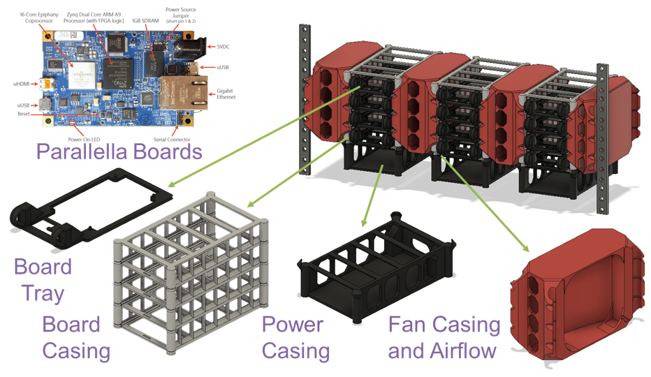

DEMAC: The **Delaware Modular Assembly Cluster** is designed to integrate an array of embedded systems witha set of 3D printed frames that provide support for the boards, the cooling units, and the power units.

<!--more-->

DEMAC: The Delaware Modular Assembly Cluster is designed to integrate an array of embedded systems witha set of 3D printed frames that provide support for the boards, the cooling units, and the power units. Each board combines the resources of a dual-core processor, a 16-core co-processor, and an embedded FPGA with the flexibility of a complete open-source stack. Having multiple nodes allows us to explore distributed versions of the Codelet Model where there is no notion of shared-memory. The mount is a low-cost implementation with a scalable structure designed to fit 4 units of a standard size rack. The files for the frames are open source and are available online along with the instructions to assembly and configure the cluster.

